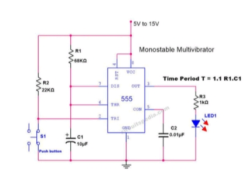
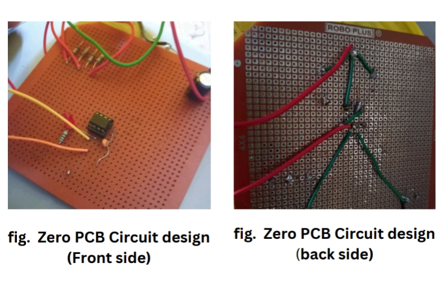
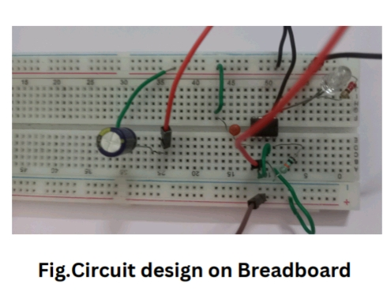

# 🔁 Monostable Multivibrator Using IC 555

This project demonstrates a **Monostable Multivibrator** circuit using the popular **IC 555 timer**. The circuit generates a **single output pulse** of fixed duration each time it is triggered. It is a foundational project in electronics, useful for understanding timing circuits and pulse generation.

---

## 📷 Project Preview

  

  

  

*Real-life circuit output with LED indication*

---

## 📄 Full Project Report

All project contents including:
- 📐 Circuit Diagram  
- 🧰 Components List  
- 🧮 Calculations (T = 1.1 × R × C)  
- 📸 Real-time Pictures  
- 📘 IC 555 Datasheet  

...are included in a single, well-organized document.

👉 **[Click here to view the full PDF report](report.pdf)**

---

## ⚙️ Circuit Overview

- The circuit uses a 555 timer configured in **monostable mode**
- When triggered (via push button), the output goes **HIGH** for a fixed time **T**, then automatically returns to **LOW**
- Time duration is determined by the formula:  
\[
  T = 1.1 \times R \times C
\]

---

## 🧰 Components Used

| Component         | Value / Type         |
|------------------|----------------------|
| IC               | 555 Timer IC         |
| Resistor (R)     | 10 kΩ (adjustable)   |
| Capacitor (C)    | 100 µF (adjustable)  |
| Push Button      | Trigger input        |
| LED + Resistor   | Output indicator     |
| Power Supply     | 5V / 9V DC           |
| Breadboard/Wires | Prototyping setup    |

---

## ⚡ Circuit Functionality

1. **Trigger the circuit** using a push button  
2. The output (Pin 3 of IC 555) goes **HIGH**  
3. The LED turns ON to indicate the pulse  
4. After time `T`, output goes LOW, LED turns OFF  
5. Circuit resets and waits for the next trigger  

---

## 📚 Applications

- Switch debouncing  
- Alarm reset systems  
- Timers and pulse generators  
- Logic pulse injection in digital circuits  
- Delay circuits for sequential tasks  

---

## 🧠 Learning Outcomes

- Understanding of IC 555 timer internal working  
- Application of RC time constant in real circuits  
- Practical experience in timing and triggering circuits  
- Breadboarding and hardware debugging skills  

---

## 📁 Folder Structure

–––
---

## 👨‍💻 Author

**Sourav Bhongade**  
Final Year Electronics and Telecommunication Engineering Student  
📧 Email: souravbhongade3004@gmail.com 

---

## 🪪 License

This project is licensed under the [MIT License](LICENSE).

---

## 🔖 Tags

`#555Timer` `#MonostableMultivibrator` `#ElectronicsProject` `#AnalogCircuits` `#FinalYearProject` `#RCtimeconstant` `#Engineering`
